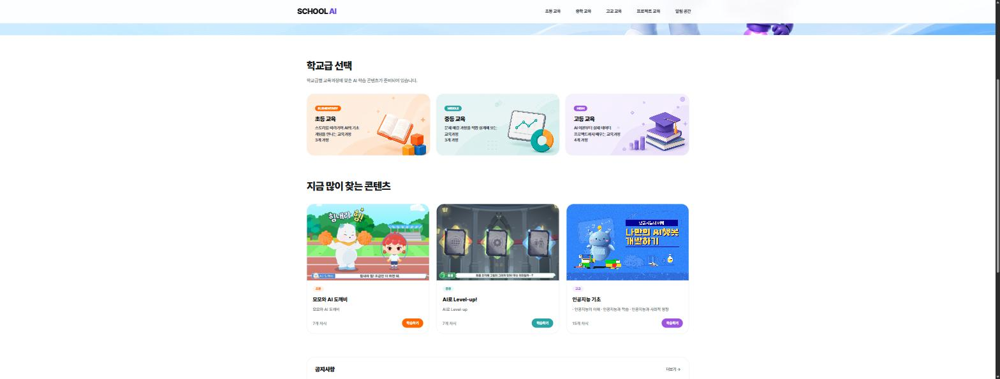
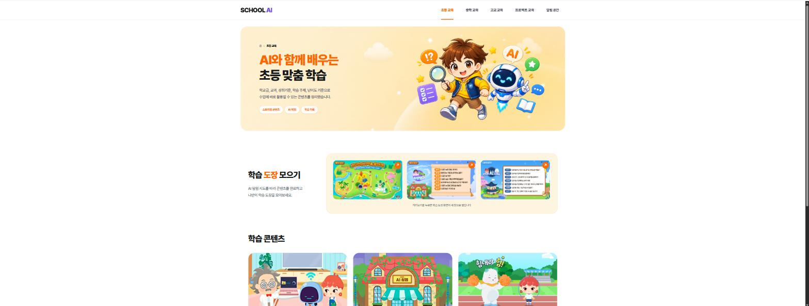

# Dandi 인수인계 문서

| 항목 | 내용 |
|---|---|
| 작성일 | 2026-10-02 |
| 작성 | 조성호(코드코리아 대표) |
| 현재 단계 | v0.2 프로토타입(로컬 실행, 기능 확인용, 디자인 최소화) |
| 다음 목표 | 10월 교사 연수 시연, UI 리디자인, 공개 HTTPS 환경 배포 |
| 요구사항 원본 | [`docs/planning/PRD.md`](./docs/planning/PRD.md) v0.4 |

이 문서는 Dandi를 처음 맡는 개발자가 "무엇을, 왜, 어디까지 만들었고, 다음에 무엇을 하면 되는지"를 한 번에 파악할 수 있도록 정리한 것입니다. 실행 방법과 경로 목록은 [`README.md`](./README.md)에 있으므로, 이 문서에서는 맥락과 다음 작업을 중심으로 설명하겠습니다.

---

## 1. 한 줄 요약

**Dandi는 교사가 AI 코딩 도구(Claude Code, Codex, Cursor 등)로 만든 교육용 미니앱·웹사이트를 링크 하나로 올리고, 학생과 동료 교사가 로그인 없이 바로 사용할 수 있게 해 주는 부산교육청 AI 빌더 교사단용 허브입니다.**

교사는 AI에게 "`<허브 주소>/llms.txt` 읽고 내 사이트 올려줘"라고 한 문장만 보내면 되고, 허브는 로그인 승인, 업로드, 개인정보 셀프점검, 공개까지의 과정을 AI가 대신 진행하도록 안내합니다.

---

## 2. 왜 만드는가 (목적)

### 2-1. 현장에서 확인된 문제

부산교육청 "AI 빌더 교사단" 단체방 논의(2026-09-01 ~ 09-28, [요약본](./docs/planning/AI빌더교사단_카톡요약_20260928.md))에서 다음 문제가 반복해서 나왔습니다.

| 문제 | 실제 사례 | Dandi가 하는 일 |
|---|---|---|
| 교사가 만든 앱이 흩어져 공유·재사용되지 않음 | 작곡 프로그램, 시험 범위 학습 사이트, 교과서 선정 서류 생성기, 업무 간소화 앱이 각자 따로 존재 | 미니앱 허브(목록·검색·학교급 필터·무로그인 실행) |
| 배포가 어렵다 | 교사에게 클라우드 설정, Git, 서버는 큰 장벽 | AI에게 링크만 주면 올라가는 흐름, CLI·MCP·웹 폴더 업로드 |
| 개인정보 사고로 앱이 멈춤 | 한 학교의 학생지도 앱이 개인정보 문제로 운영위원회 통과 전까지 사용 보류 | 입력 시 개인정보 자동 차단·마스킹, 공개 전 셀프점검 5문항, 승인 대기 상태 |
| AI API 비용을 교사가 부담 | 교사가 유료 API를 개인 비용으로 구매 | 프로젝트별 API 키, 무상 한도, 게이트웨이 |
| 어떤 AI 모델을 써도 되는지 기준 없음 | 중국 모델 허용 여부를 두고 의견 대립, 교육청 판단 대기 | 교육청 관리자가 모델 허용·보류·차단을 설정하고 이력을 남김 |

### 2-2. 지향점

- **교사 비용 0원, 압도적으로 단순한 배포.** 교사는 바쁘기 때문에 웹 대시보드나 Git 명령을 배우게 하지 않고, AI 코딩 도구가 대신 실행하게 만듭니다.
- **토스 미니앱처럼 무로그인 사용.** 학생·학부모·동료 교사는 링크를 누르면 회원가입 없이 바로 앱을 실행하고 자료를 내려받습니다.
- **안심하고 공유하는 안전지대.** 개인정보를 시스템 차원에서 걸러 내고, 학교 내부 승인이 필요한 앱은 승인 전까지 공개하지 않습니다.
- **스스로 만드는 교사.** 예시 사이트와 작업 지시서를 짝으로 제공해 교사가 자기 버전을 직접 만들어 보게 합니다.

### 2-3. 이해관계자

| 누구 | 역할 |
|---|---|
| 부산교육청 AI 빌더 교사단 | 실제 사용자이자 요구사항 제공자. 10월 연수 참여 교사 포함 |
| 부산교육청 장학사(이응재 장학사 등) | 모델 허용 정책, 가이드라인, 예산 등 정책 판단. UI 참고 사이트 전달(4장) |
| 코드코리아(조성호 대표) | 기획·개발 주체. 제품 결정은 대표에게 확인 |

**주의:** 교사단에서 합의되지 않은 의견을 문서나 화면에 "확정"으로 쓰지 마십시오. 이전 검증에서 과장 표현으로 지적받은 적이 있습니다. 모델 허용 정책은 교육청이 정하고, 플랫폼은 설정 기능만 제공합니다.

---

## 3. 무엇을 만드는가 (기능 지도)

PRD의 기능 ID(F-xx)를 함께 적었습니다. 자세한 수용 기준은 PRD 6장과 15장을 참고하시기 바랍니다.

### 3-1. 사용자별 화면

| 사용자 | 할 수 있는 일 |
|---|---|
| 익명 방문자(학생 등) | 허브 둘러보기, 미니앱 실행, 게시글 읽기, 자료 다운로드, 전자책 읽기 |
| 교사(로그인) | 앱·사이트 올리기, 프로젝트·API 키 관리, 글·댓글 작성, 파일·스킬·템플릿 게시 |
| 교육청 관리자 | AI 모델 허용 정책, 모델 가이드 편집, 승인 대기 앱 처리, 스킬 검토, 감사 로그 확인 |

### 3-2. 기능 묶음

| 묶음 | 내용 | 주요 경로 | PRD |
|---|---|---|---|
| 미니앱 허브 | 앱 목록·검색·학교급/분류 필터, 무로그인 실행, 개인정보 배지 | `/`, `/apps` | F-04~F-06 |
| 커뮤니티·자료실 | 게시판, 파일 업로드·무로그인 다운로드 | `/community`, `/files` | F-07, F-08 |
| 템플릿·가이드 | 예시 사이트 + 작업 지시서 쌍, 개발~배포 안내 | `/templates`, `/guide` | F-09~F-12 |
| 개인정보 보호 | 클라이언트·서버 양쪽 PII 검사(주민번호·전화·이메일 등), 셀프점검 5문항, 승인 대기 | `src/lib/pii.ts` | F-13~F-16 |
| **AI 에이전트 연결** | `/llms.txt` 실행 런북, CLI 브라우저 승인 로그인, 원격 MCP + OAuth, stdio MCP | `/connect`, `/llms.txt`, `/device`, `/mcp` | F-51~F-62 |
| 허브 정적 호스팅 | 비공개 미리보기 → 셀프점검 → 공개, 사이트별 별도 origin | `/studio/sites` | F-51, F-52 |
| 프로젝트·API 키 | Edge Impulse 방식(프로젝트마다 여러 키, 역할, 1회 표시, 만료, 한도) | `/studio/projects` | F-31~F-35 |
| AI 게이트웨이 | 교육청 허용 모델 ∩ 프로젝트 허용 모델만 통과, 프롬프트 개인정보 마스킹 | `/ai`, `/api/ai/*` | F-21~F-24, F-34 |
| 스킬 레지스트리 | skills.sh 방식, `npx skills add <허브>`로 설치, 스크립트 포함 스킬은 관리자 검토 | `/skills` | F-37~F-41 |
| 전자책 서가 | 웹북 URL 등록(목차 자동 수집), PDF 리더, 저작권 게이트 | `/books` | F-43~F-45 |
| 문서 | 사람용 `/docs`, AI용 `/llms.txt`·`/llms-full.txt`·`/docs/<주제>.md` | `/docs` | F-60 |
| 관리자 | 모델 정책, 승인 대기, 스킬 검토, 감사 로그 | `/admin` | F-23, F-24, F-27 |

### 3-3. 핵심 흐름: "AI에게 링크만 주면 사이트가 올라간다"

Dandi에서 가장 중요한 흐름이므로, 다른 기능을 고칠 때도 이 흐름이 깨지지 않는지 반드시 확인하시기 바랍니다.

```text
교사: "https://<허브>/llms.txt 읽고 이 폴더 내 사이트 올려줘"
  │
  ├─ AI가 /llms.txt(실행 런북)를 읽음
  ├─ npx -y <허브>/dandi-<버전>.tgz login --json  → 승인 링크·8자리 코드 출력
  ├─ 교사가 브라우저에서 /device 열고 코드가 같으면 [승인]   ← 토큰 복사 없음
  ├─ AI가 같은 차례에서 login --wait 로 승인 대기 후 계속
  ├─ deploy <폴더> → 비공개 미리보기 주소
  ├─ AI가 교사에게 등록 정보 + 셀프점검 5문항을 한 번에 질문
  └─ publish → 허브 등록(승인 필요로 답하면 "승인 대기")
```

로컬 허브에서는 Claude Code의 WebFetch가 `localhost`를 막기 때문에 링크 대신 `npx -y http://localhost:3000/dandi-<버전>.tgz guide` 명령을 사용합니다. 공개 HTTPS 허브가 생기면 링크 한 줄로 시연할 수 있습니다.

### 3-4. 이번 범위에서 하지 않는 것

PRD 10장(Non-Goals)을 참고하시기 바랍니다. 대표적으로 익명 배포 후 클레임(F-59, 학생 개인정보·피싱 위험으로 보류), EPUB 리더, 유료 교재 판매 등은 이번 범위에 포함하지 않습니다.

---

## 4. UI 디자인 참고: SCHOOL AI (sai.software.kr)

부산교육청 이응재 장학사께서 "단디 AI UI 구성 시 참고사이트"로 [https://sai.software.kr/](https://sai.software.kr/)를 보내 주셨습니다. 현재 Dandi는 기능 확인용이라 디자인이 거의 없으므로, **UI 리디자인은 이 사이트의 톤과 정보 구조를 기준으로 진행**하시기 바랍니다. 아래 내용은 2026-10-02에 사이트를 직접 열어 확인한 것입니다.

### 4-1. 사이트 개요

SCHOOL AI는 초·중·고 교육과정에 맞춘 AI 학습 콘텐츠를 학교급별로 모아 둔 사이트입니다. React(Vite) 단일 페이지 앱이며, 운영 주체는 화면에서 따로 확인하지 못했습니다.

| 메인 화면 | 초등 교육 화면 |
|---|---|
|  |  |

### 4-2. 화면 구성

**메인(`/`)**

1. **상단 바:** 왼쪽에 `SCHOOL AI` 로고(AI만 보라색 강조), 오른쪽에 `초등 교육 · 중학 교육 · 고교 교육 · 프로젝트 교육(드롭다운) · 알림 공간` 메뉴가 있습니다. 메뉴가 학교급 중심으로 짜여 있다는 점이 핵심입니다.
2. **히어로:** 하늘색 그라데이션 배경에 "AI와 함께 배우는 우리 학교 수업"이라는 큰 제목, 두 줄 설명, 오른쪽에 3D 캐릭터 로봇 일러스트가 배치되어 있습니다.
3. **오른쪽 고정 퀵 배너:** "우주RUN START", "전연령 AI 교육 바로가기" 같은 바로가기 카드가 화면 오른쪽에 떠 있습니다.
4. **학교급 선택:** 초등(주황)·중등(청록)·고등(보라) 세 장의 파스텔 카드에 영문 배지(ELEMENTARY/MIDDLE/HIGH), 한 줄 설명, 과정 수, 3D 아이콘이 들어 있습니다.
5. **지금 많이 찾는 콘텐츠:** 썸네일 이미지 카드 3장에 학교급 태그, 제목, 차시 수, 학교급 색의 "학습하기" 버튼이 있습니다.
6. **공지사항:** 분류·제목·날짜로 된 목록과 "더보기 →" 링크가 있습니다.

**학교급 화면(`/elementary` 등)**

- 빵 부스러기(홈 › 초등 교육), 학교급 색으로 칠한 둥근 히어로 박스, 태그 칩(스토리형 콘텐츠·AI 체험·학습 기록)이 있습니다.
- "학습 도장 모으기"처럼 진도를 게임처럼 보여 주는 영역과, 썸네일·설명·차시 수·"학습하기" 버튼으로 된 콘텐츠 카드 목록이 이어집니다.

### 4-3. Dandi에 적용할 점

SAI는 "만들어진 학습 콘텐츠를 소비하는 사이트"인 반면, Dandi는 "교사가 만든 앱을 올리고 나누는 허브"입니다. 따라서 화면을 그대로 복제하지 말고 다음 요소를 가져오시기 바랍니다.

| SAI 요소 | Dandi 적용안 |
|---|---|
| 학교급 중심 상단 메뉴 | 허브의 학교급 필터(초·중·고·특수)를 상단 메뉴나 첫 화면 카드로 끌어올림. 교사단 논의에서도 학교급별 열람 요구가 있었음(PRD P8) |
| 학교급별 색 체계(주황·청록·보라) | 앱 카드의 학교급 배지, 필터, 버튼 색을 학교급별로 통일 |
| 히어로 + 캐릭터 일러스트 | Dandi 첫 화면에 "AI로 만든 수업·업무 앱을 한곳에서" 같은 메시지와 대표 일러스트 |
| "지금 많이 찾는 콘텐츠" 썸네일 카드 | 인기 미니앱 카드(썸네일 스크린샷, 학교급 태그, 실행 수, "실행하기" 버튼) |
| 공지사항 목록 | 커뮤니티 최신 글·공지 영역 |
| 오른쪽 퀵 배너 | "AI로 내 사이트 올리기(/connect)", "전자책 서가" 바로가기 |
| 파스텔 톤, 둥근 카드, 넉넉한 여백 | 전체 디자인 토큰(색·반경·그림자)으로 정의해 모든 화면에 적용 |

리디자인을 시작하기 전에 디자인 토큰과 주요 화면(허브, 앱 상세, 스튜디오, `/connect`) 시안을 먼저 만들어 대표에게 확인받으시기 바랍니다. 장학사께 보여 드릴 시안이므로, 교육청 공식 사이트처럼 보이는 로고나 문구는 사용하지 않습니다.

---

## 5. 현재 상태 (2026-10-02 기준)

### 5-1. 완료된 것

- v0.1(허브·커뮤니티·자료실·템플릿·개인정보 필터·CLI·게이트웨이·관리자)과 v0.2(에이전트 연결·프로젝트 키·스킬·서가·문서 분리)의 P0 기능을 구현했습니다.
- 단위 테스트 209개, 타입체크, 린트를 모두 통과합니다(`npm test`, `npm run typecheck`, `npm run lint`).
- 실제 Chrome E2E 16단계 시나리오가 통과합니다(`e2e/demo.e2e.mjs`).
- Grok, Antigravity, 맥락 없는 Claude가 "URL만 주기 / URL과 답을 함께 주기 / 스킬 설치 후 요청" 시나리오를 모두 통과했습니다. 기록은 [`docs/agent-trials-20260929.md`](./docs/agent-trials-20260929.md)에 있습니다.

### 5-2. 프로토타입이라 대신 넣은 것(실서비스 전환 대상)

외부 계정 없이 로컬에서 바로 실행되도록 다음을 대체물로 구현했습니다. 저장소 계층(`src/lib/db.ts`와 도메인 파일)만 바꾸면 Supabase로 옮길 수 있게 설계했습니다.

| 실서비스 | 현재 대체물 |
|---|---|
| Supabase 익명 인증 | 브라우저 세션 쿠키 |
| 구글·카카오 로그인 | 비밀번호 없는 데모 로그인(이름·역할·학교급) |
| PostgreSQL + RLS | 로컬 JSON 저장소(`data/db.json`) + 서버 코드의 작성자 검사 |
| Supabase Storage | 로컬 파일 저장소(`data/`) |
| 실제 AI 모델 | 모의 응답 |

### 5-3. 아직 안 된 것

- 공개 HTTPS 환경이 없습니다. 이 때문에 "링크만 주면 올라가는" 흐름과 claude.ai·ChatGPT 웹 커넥터 연결을 실제 링크로 시연하지 못합니다.
- Codex 시험은 PC의 Codex 로그인 만료로 보류 상태입니다.
- CLI의 npm 공개(`dandi-cli` 이름) 여부가 미정입니다(npm의 `dandi`는 다른 사람의 패키지입니다).
- 교사 사이트 전용 도메인이 없습니다(사이트가 허브와 다른 도메인에서 서빙되어야 허브 세션이 안전합니다).
- 디자인이 최소 수준입니다(4장 참고).

---

## 6. 다음에 할 일 (우선순위 순)

| 순서 | 작업 | 완료 기준 | 관련 |
|---|---|---|---|
| 1 | **UI 리디자인** | SAI 톤을 반영한 디자인 토큰과 허브·앱 상세·스튜디오·`/connect`·서가 화면 적용. 기존 E2E가 그대로 통과 | 4장 |
| 2 | **공개 HTTPS 시연 환경** | 코드코리아 서버(Caddy + Cloudflare)에 배포, `HUB_ORIGIN`·`SITES_DOMAIN`·`TRUST_PROXY` 설정, 외부 PC에서 `<허브>/llms.txt` 링크 한 줄로 배포 성공 | PRD Q10, Q12, README "운영 환경 변수" |
| 3 | **10월 연수 시연 리허설** | README "시연 순서" 1~7을 공개 환경에서 끝까지 진행, 막히는 지점 기록 | PRD 13장 |
| 4 | Codex 시험 | `docs/agent-trials-20260929.md`와 같은 방식으로 A·B·C 시나리오 기록 추가 | F-62 |
| 5 | v1.0 전환 | Supabase(Anonymous Auth, DB, Storage, RLS), 구글·카카오 로그인, 실제 AI 모델 연결 | PRD 8장, 13장 |
| 6 | CLI npm 공개 | 대표 결정 후 `dandi-cli`로 공개, 런북·문서의 `npx` 명령 교체 | PRD Q11 |

1·2번은 병행할 수 있습니다. 정책이 걸린 항목(모델 허용, 예산, 승인 주체 등)은 PRD 12장 미결 사항 Q1~Q16의 결정 주체를 먼저 확인하고, 임의로 정하지 마시기 바랍니다.

---

## 7. 읽어 볼 것 (권장 순서)

### 7-1. 저장소 안 문서

| 순서 | 문서 | 왜 읽는가 | 분량 |
|---|---|---|---|
| 1 | 이 문서 | 전체 맥락 | 10분 |
| 2 | [`README.md`](./README.md) | 실행 방법, 시연 순서, 경로·코드 구조, 운영 환경 변수 | 10분 |
| 3 | [`docs/planning/PRD.md`](./docs/planning/PRD.md) | 요구사항 원본. 최소 0장(현장 문제), 2장(전략), 12장(미결 사항), 13장(로드맵), 15장(v0.2 기능)은 꼭 읽으십시오 | 40분 |
| 4 | [`docs/planning/AI빌더교사단_카톡요약_20260928.md`](./docs/planning/AI빌더교사단_카톡요약_20260928.md) | 사용자(교사단)가 실제로 무슨 이야기를 했는지 | 10분 |
| 5 | [`docs/planning/벤치마크_AI연결_프로젝트키_스킬_전자책_20260928.md`](./docs/planning/벤치마크_AI연결_프로젝트키_스킬_전자책_20260928.md) | 에이전트 연결·프로젝트 키·스킬·서가를 왜 이렇게 설계했는지(힉스필드·Vercel·Edge Impulse·skills.sh 비교) | 40분 |
| 6 | [`docs/v0.2-contracts.md`](./docs/v0.2-contracts.md) | 모듈 사이 인터페이스 계약(데이터 형태, API, 오류 코드) | 30분 |
| 7 | [`docs/agent-trials-20260929.md`](./docs/agent-trials-20260929.md) | AI 도구 실제 시험 방법과 거기서 찾아 고친 문제 | 10분 |
| 8 | [`AGENTS.md`](./AGENTS.md) | **Next.js 16은 학습 데이터와 API가 다릅니다.** 코드를 고치기 전에 `node_modules/next/dist/docs/`의 해당 가이드를 확인하십시오 | 2분 |
| 9 | 앱 안의 `/docs`, `/llms.txt`, `/llms-full.txt` | 교사와 AI가 실제로 보는 안내문 | 15분 |

### 7-2. 외부 자료

**디자인 참고**

- SCHOOL AI: https://sai.software.kr/ (4장)
- 코드코리아 웹북(서가 첫 책): https://shain1912.github.io/vibecoding-map-book/

**AI 에이전트 연결(Dandi의 핵심 흐름)**

- 힉스필드 CLI·MCP(“쉬운 연결”의 기준): https://higgsfield.ai/cli, https://higgsfield.ai/mcp
- netlify.ai(에이전트가 배포하는 흐름): https://netlify.ai
- Vercel CLI 로그인 흐름: https://vercel.com/changelog/new-vercel-cli-login-flow
- Stripe CLI 로그인과 `llms.txt`: https://docs.stripe.com/cli/login, https://docs.stripe.com/llms.txt
- Claude 커넥터 인증(원격 MCP + OAuth): https://claude.com/docs/connectors/building/authentication

**프로젝트 API 키**

- Edge Impulse API 키(설계 기준): https://docs.edgeimpulse.com/studio/projects/dashboard/api-keys
- OpenAI 프로젝트 지출 한도: https://developers.openai.com/api/docs/guides/spend-limits
- Anthropic 워크스페이스: https://platform.claude.com/docs/en/manage-claude/workspaces

**스킬 레지스트리**

- skills.sh 문서: https://skills.sh/docs
- Agent Skills 명세: https://agentskills.io/specification
- Agent Skills Discovery(`/.well-known/agent-skills`): https://github.com/cloudflare/agent-skills-discovery-rfc
- 설치 CLI 소스: https://github.com/vercel-labs/skills
- 악성 스킬 조사(검토 기능의 근거): https://snyk.io/blog/toxicskills-malicious-ai-agent-skills-clawhub/

**전자책 서가**

- react-pdf: https://github.com/wojtekmaj/react-pdf
- foliate-js(EPUB 후속): https://github.com/johnfactotum/foliate-js

**v1.0 전환**

- Supabase API 키: https://supabase.com/docs/guides/api/api-keys

---

## 8. 개발 시 주의사항

1. **개인정보가 최우선입니다.** 새 입력창이나 API를 만들 때는 반드시 `src/lib/pii.ts` 검사를 클라이언트와 서버 양쪽에 연결하십시오. 학생 정보가 노출되는 사고는 서비스 전체를 멈추게 할 수 있습니다.
2. **"링크만 주면 올라간다" 흐름을 깨지 마십시오.** CLI 출력, 종료 코드, `/llms.txt` 런북 문구를 바꾸면 AI 도구의 동작이 달라집니다. 바꾼 뒤에는 E2E와 실제 AI 도구 시험을 다시 실행하십시오. 런북 원문은 `src/lib/runbook.ts`와 `src/lib/docs/`에 있습니다.
3. **CLI는 의존성이 없습니다.** `cli/`는 외부 패키지 없이 Node 내장 기능만 사용하므로, 새 의존성을 넣지 마십시오. 내용이 바뀌면 tarball 이름(`dandi-<버전>-<해시>.tgz`)이 바뀌어 `npx` 캐시 문제를 피합니다.
4. **사이트는 허브와 다른 origin에서 서빙합니다.** 교사가 올린 JS가 허브 세션을 읽지 못하게 하기 위한 보안 설계이므로, 같은 도메인의 경로(`/sites/<이름>`)로 바꾸지 마십시오.
5. **데이터 초기화는 `data/` 폴더 삭제로 합니다.** 다시 실행하면 시드 데이터가 만들어집니다. `data/`는 Git에 올라가지 않습니다.
6. **비밀값을 커밋하지 마십시오.** `.env*`는 무시 목록에 있습니다. 테스트 코드의 `sk-...` 문자열은 비밀값 차단 기능을 시험하는 가짜 값입니다.
7. **교사단·교육청 정책은 설정으로만 다룹니다.** 특정 모델 허용 여부 같은 결정을 코드에 고정하지 마십시오.

---

## 9. 빠른 시작

```bash
git clone https://github.com/shain1912/dandi.git
cd dandi
npm install
npm run dev            # http://localhost:3000
npm test && npm run typecheck && npm run lint
```

Node.js 22 이상이 필요합니다. 처음 실행하면 예시 미니앱, 템플릿, 게시글, AI 모델, 스킬, 웹북이 시드 데이터로 들어갑니다. 시연 순서는 README의 "시연 순서"를 그대로 따라 해 보시기 바랍니다. 직접 한 번 끝까지 진행해 보는 것이 코드를 읽는 것보다 구조를 빨리 이해하는 방법입니다.
